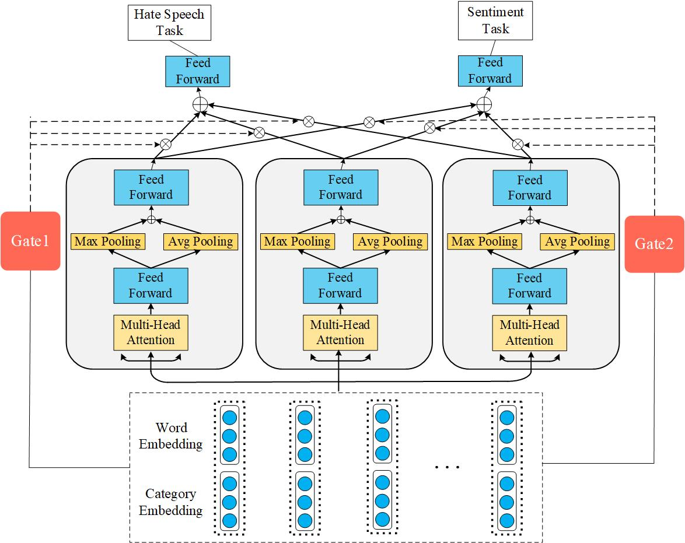

# SKS
This repository provides code for the paper "Hate Speech Detection based on Sentiment Knowledge Sharing"

# Requirements
Python>=3.7

tensorflow>=2.0

# Data
[DV](https://github.com/t-davidson/hate-speech-and-offensive-language), [SE](http://hatespeech.di.unito.it/hateval.html), [SA](https://www.kaggle.com/dv1453/twitter-sentiment-analysis-analytics-vidya)

# Usage
After download the data and the pre-trained word vectors, just run the sample_run.sh

